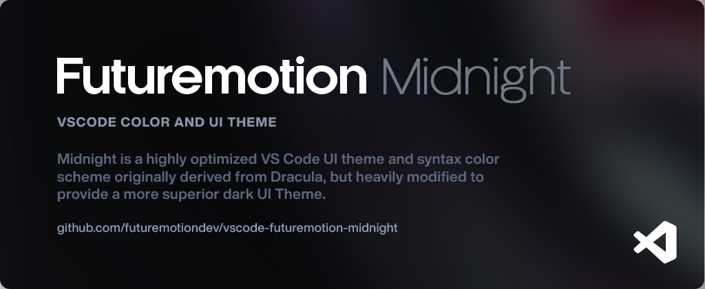
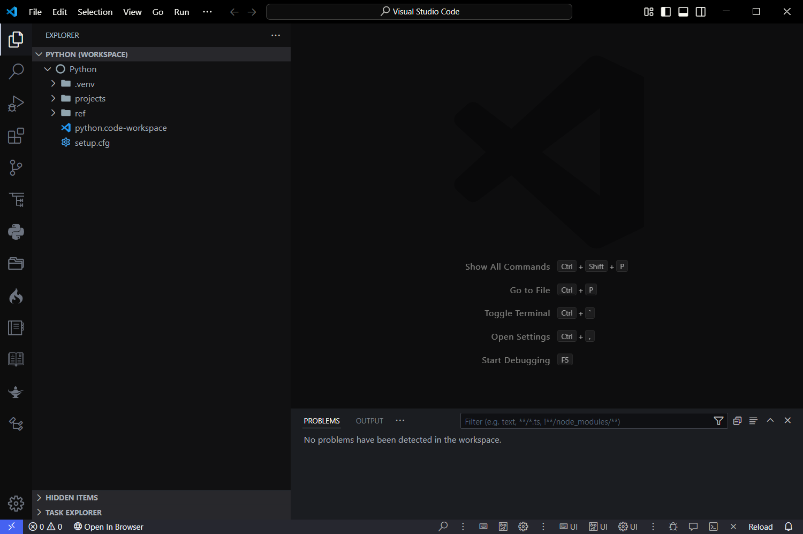

# Futuremotion Midnight for [Visual Studio Code](http://code.visualstudio.com)

A highly optimized dark theme for [Visual Studio Code](http://code.visualstudio.com).

---

## Install

1. Open the extensions marketplace from the sidebar
2. Search for `Futuremotion Midnight`
3. Click on it, and then click on install

## Activating theme

Futuremotion Midnight can be activated by selecting `File -> Preferences -> Color Theme`.

## Screenshot

## License

[MIT License](./LICENSE)
